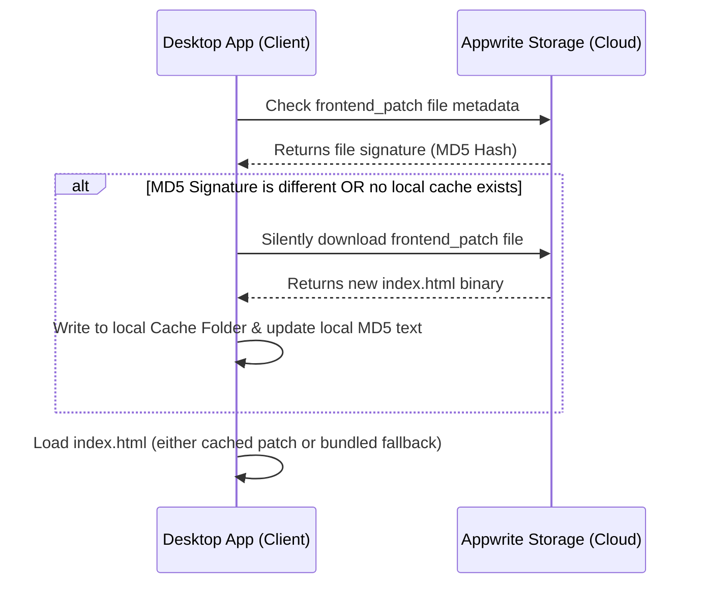

# 📡 AutoContent Pro: Stealth OTA (Over-the-Air) Update Guide

AutoContent Pro features a highly robust, built-in **Stealth OTA (Over-the-Air) Patching Engine**. This allows you to instantly update the application's user interface, styling, and client-side logic (`index.html`) on all active user installations globally without requiring them to reinstall or download a new installer!

---

## 🛠️ How it Works under the Hood



1. **Check**: Every time the desktop application is opened, it queries your Appwrite Cloud Storage metadata for a file with the ID `frontend_patch`.
2. **Compare**: It compares the MD5 signature (`signature` attribute) of the remote file against the local cached patch's signature (`patch_hash.txt`).
3. **Apply**: If the remote signature differs, the app silently downloads the new `index.html` binary in the background and writes it to the local User Data directory (`%APPDATA%/AutoContent Pro/index.html`).
4. **Boot**: The app then boots into the new, patched user interface instantly and seamlessly!

---

## 🚀 Step-by-Step: How to Push an OTA Update

When you want to deploy a frontend update to all users on-air:

### Step 1 — Prepare your updated UI File
Make your changes inside `D:\autocontent\index.html`. Make sure the HTML is fully functional and contains all required JavaScript integrations for your workstation interface.

### Step 2 — Upload to Appwrite Cloud Storage
1. Go to your [Appwrite Cloud Console](https://cloud.appwrite.io) and select your **Autocontent** project.
2. In the left navigation, click on **Storage** ➜ select/create a bucket named **`patches`** (ID: `patches`).
   * *Ensure the bucket settings allow **Read** permission for `Any` or `guest` so the client app can read metadata and download the file securely.*
3. Inside the `patches` bucket, click **Upload File**.
4. Drag and drop your **`index.html`** file.
5. ⚠️ **CRITICAL: Set the File ID manually to exactly:**
   ```
   frontend_patch
   ```
   *(If a file with this ID already exists, simply click on the three dots next to it and select **Update File / Replace File** to upload the new version under the same ID!)*

### Step 3 — Verification
The next time you launch your local or compiled app, you will see a console message or a silent background load downloading the patch. It will automatically initialize the new interface on boot!

---

## ⚠️ Cache-Busting & Best Practices

### 🔄 Forcing cache eviction on major updates
If you release a major desktop app version (e.g. updating the Python core `app.py` via a new Setup installer) and want to discard old cached frontends:
* The app automatically checks if `APP_VERSION` in `app.py` has changed.
* If a new setup is installed, the app automatically deletes all local OTA caches on first boot to guarantee that the new bundled resources are clean and in place!

### 🧪 Local Testing before Live Deployment
Always test your `index.html` inside the local developer environment before uploading it as a live patch:
```powershell
# Run the app locally to test your HTML changes
python app.py
```
Once you are 100% satisfied that your UI changes connect correctly to your Appwrite functions, proceed with the Appwrite Storage upload.
